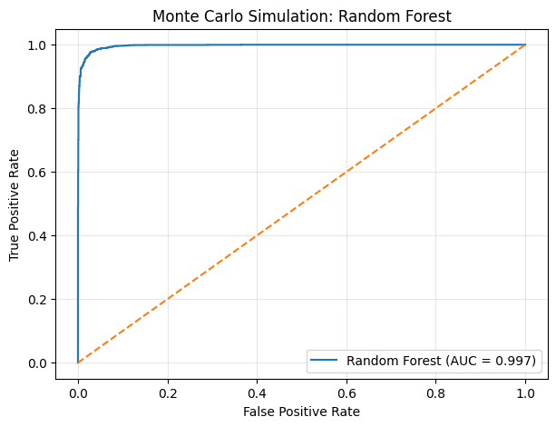
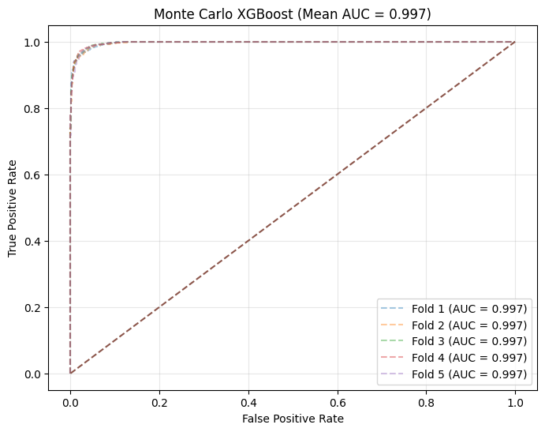
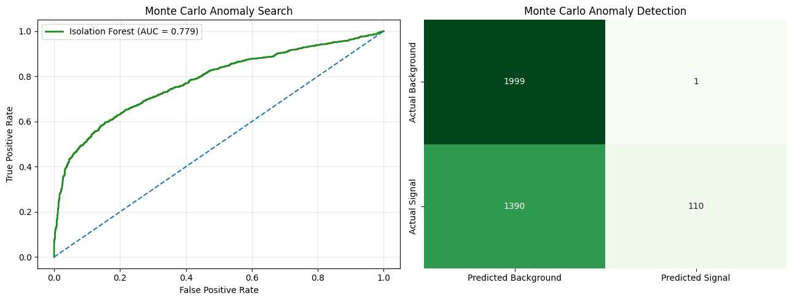
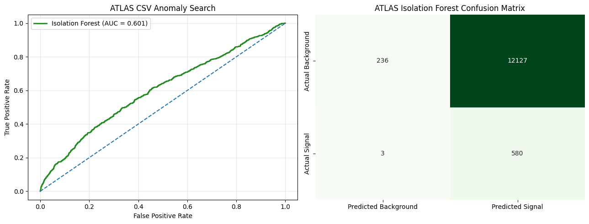
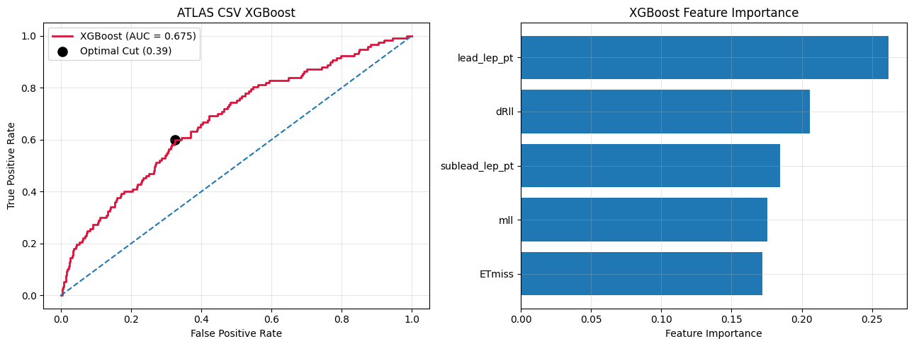
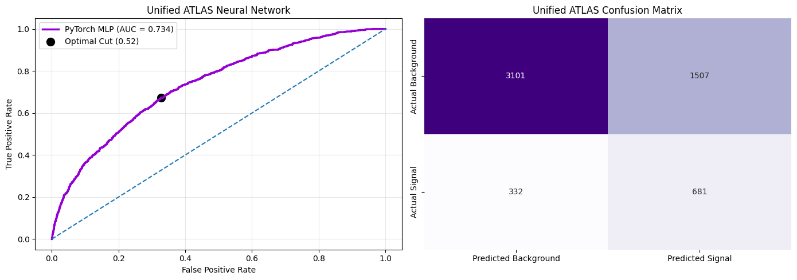

# Project Overview

This project utilizes open data from ATLAS and a stochastic simulation to model the search for dark matter (https://opendata.cern.ch/record/atlas-93942). It does this by training a neural-network classifier that distinguishes signal events from Standard Model background. The model uses five kinematic variables—missing transverse energy, dilepton invariant mass, leading- and subleading-lepton transverse momentum, and dilepton angular separation. It includes class-imbalance weighting, hyperparameter optimization, learning-rate decay, ROC/AUC evaluation, and an optimized classification threshold.

---

# Results

---

# Advanced Model Evaluations

### SECTION 1: RANDOM FOREST
**ROC AUC:** 0.9969

```text
              precision    recall  f1-score   support

  Background       0.98      0.97      0.97      2800
 Dark Matter       0.97      0.98      0.97      2800

    accuracy                           0.97      5600
   macro avg       0.97      0.97      0.97      5600
weighted avg       0.97      0.97      0.97      5600
```
---

### SECTION 2: MONTE CARLO XGBOOST
**Mean ROC AUC:** 0.9972 ± 0.0002

---


### SECTION 3: MONTE CARLO ISOLATION FOREST
* **ROC AUC:** 0.7789
* **Optimal Threshold:** 0.1860
* **\(S/sqrt{B}\):** 110.00

---


### SECTION 4: LOCAL ATLAS CSV ISOLATION FOREST
* **ROC AUC:** 0.6006
* **Optimal Threshold:** -0.1490

---


### SECTION 5: LOCAL ATLAS CSV XGBOOST
* **ROC AUC:** 0.6746
* **Optimal Threshold:** 0.3868

```text
              precision    recall  f1-score   support

  Background       0.97      0.68      0.80      2473
 Dark Matter       0.08      0.60      0.14       117

    accuracy                           0.67      2590
   macro avg       0.53      0.64      0.47      2590
weighted avg       0.93      0.67      0.77      2590
```

---


### SECTION 6: UNIFIED ATLAS PYTORCH MLP
* **Validation ROC AUC:** 0.7341
* **Optimal Threshold:** 0.5185
* **Best Parameters:** `{'lr': 0.001, 'dropout': 0.2, 'batch_size': 128}`

```text
                      precision    recall  f1-score   support

 Combined Background       0.90      0.67      0.77      4608
All Signals Included       0.31      0.67      0.43      1013

            accuracy                           0.67      5621
           macro avg       0.61      0.67      0.60      5621
        weighted avg       0.80      0.67      0.71      5621
```

---


## Final Method Comparison

| Dataset | Method | Supervision | ROC AUC |
| :--- | :--- | :--- | :--- |
| Monte Carlo simulation | XGBoost | Supervised | 0.997184 |
| Monte Carlo simulation | Random Forest | Supervised | 0.996909 |
| Monte Carlo overlap simulation | Isolation Forest | Unsupervised | 0.778867 |
| ATLAS WZ + ZZ + Z+jets + Non-resonant_ll + DM masses | PyTorch MLP | Supervised | 0.734092 |
| ATLAS WZ + DM_500 CSV | XGBoost | Supervised | 0.674640 |
| ATLAS WZ + DM_500 CSV | Isolation Forest | Unsupervised | 0.600575 |
