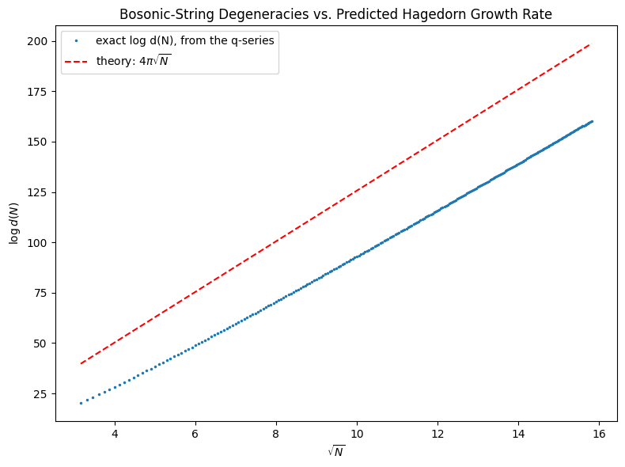

# Project Overview

This project analyses of the spectrum and high-energy state growth of the 26-dimensional critical bosonic string.
The analysis begins with the exact string partition function $$ Z(q)=\frac{1}{\eta(\tau)^{24}} = q^{-1}\prod_{n=1}^{\infty}(1-q^n)^{-24}$$, where the 24 transverse oscillators arise from quantizing the bosonic string in light-cone gauge. The coefficients of this expansion are calculated directly as exact integers using power-series multiplication, giving the number of physical states at each excitation level. The resulting spectrum explicitly contains the bosonic-string tachyon at \(N=0\), the massless level at \(N=1\), and rapidly increasing degeneracies at higher levels.
It then examines the asymptotic behavior of these exact state counts. Using the modular transformation of the Dedekind eta function and a saddle-point argument, it derives the exponential growth $$d(N)\sim e^{4\pi\sqrt{N}}$$, up to a power-law prefactor. The exact integer degeneracies are compared with this prediction numerically over hundreds of excitation levels, and a fit including the power-law correction recovers a leading coefficient close to the theoretical \(4\pi\) value.
The asymptotic state growth is then translated into the Hagedorn temperature through the string mass relation \(\alpha' m^2=N-1\), giving $$T_H=\frac{1}{4\pi\sqrt{\alpha'}}$$.
The analysis compares the exact degeneracy at a high excitation level with the leading Hagedorn exponential, illustrating the rapid growth of the string density of states.
The project is specifically an analysis of the bosonic string. Its critical dimension is \(D=26\), and the spectrum contains a tachyonic ground state, so the project treats the results as an exact study of the bosonic-string model rather than as a realistic theory of nature.

---

# Results

---


### SECTION 2: Physical Mass Spectrum
```text
                  mass_squared (alpha'=1)    degeneracy d(N)

               0                      -1                  1
               1                       0                 24
               2                       1                324
               3                       2               3200
               4                       3              25650
               5                       4             176256
               6                       5            1073720
               7                       6            5930496

```

### SECTION 3: Degeneracy Growth

---


### SECTION 4: Fitting the Asymptotic Form
```text
                  quantity        value     theory

               0         A    12.409409  12.566371
               1         B    -5.329888        NaN
               2         C    -6.539788        NaN
               3  max_abs_residual     0.153885        NaN

```

### SECTION 5: Hagedorn Temperature
```text
                  quantity        value                 expression

               0       T_H     0.079577    1/(4*pi*sqrt(alpha'))
               1    beta_H    12.566371         4*pi*sqrt(alpha')

```
### SECTION 6: Degeneracy with Leading Hagedorn Growth Comparison
```text
                     quantity         value

               0  mass level N   250.000000
               1  mass in string units    15.779734
               2       log10 exact d(N)    69.607927
               3        log10 exp(m/T_H)    86.117983
```

