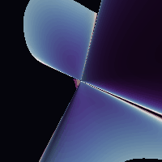

# Project Overview

This project explors how a higher-dimensional algebraic geometry can be represented through a three-dimensional projection.
The visualization constructs a quintic-style algebraic surface using a scalar field inspired by the relation $\sum z_i^5 = 0$. Five fixed three-dimensional directions serve as projections of the underlying complex coordinates, while their phases are controlled by a single rotation parameter. As the parameter changes, the resulting three-dimensional level surface deforms, which produces a changing shadow of the higher-dimensional construction.
The surface is rendered numerically using ray marching. For each camera ray, the program repeatedly estimates the distance to the implicit surface using the field value and its numerical gradient. Once the ray approaches the surface, the gradient provides an estimate of the surface normal, which is then used for three-dimensional lighting and shading.

The project is explicitly a mathematical visualization instead of a physical simulation. It does not calculate the true Ricci-flat Calabi–Yau metric or model photons propagating through a physical six-dimensional geometry. Instead, it uses an algebraic stand-in to visualize how a higher-dimensional mathematical structure can produce a three-dimensional projection.
The final section renders multiple values of the rotation parameter and combines them into an animation, allowing the evolution of the projected surface to be viewed continuously.

---

# Results

---

---
