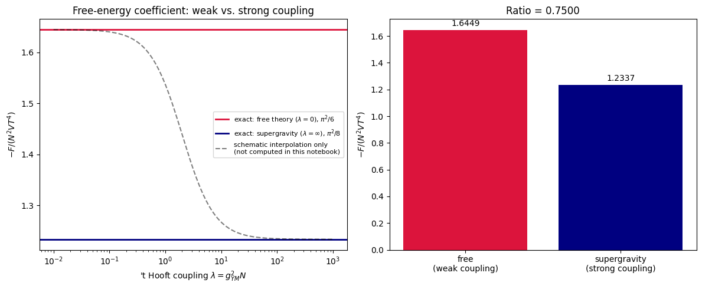

# Project Overview

This project analyses $3/4$ result connecting finite-temperature $\mathcal{N}=4$ super-Yang–Mills theory with its strong-coupling gravitational description.
It begins on the weak-coupling side by constructing the thermal degrees of freedom of $\mathcal{N}=4$ $SU(N)$ super-Yang–Mills. It counts the on-shell bosonic and fermionic degrees of freedom and uses the standard free-particle thermal expressions to derive the theory's entropy, energy, and free-energy densities symbolically.
The strong-coupling calculation instead takes the known near-extremal black 3-brane entropy result from classical type-IIB supergravity, $S = \frac{\pi^2}{2}N^2VT^3$, and uses conformal invariance to obtain the corresponding free energy. The project does not rederive the ten-dimensional black-brane solution. It begins from the established supergravity result and carries out the remaining algebra.
The two limits are then compared symbolically. The calculation gives the exact relation $$\frac{F_{\mathrm{strong}}}{F_{\mathrm{free}}} = \frac{3}{4}$$, equivalently giving a $3/4$ ratio for the corresponding thermal entropy coefficients. It also visualizes the two exact endpoints as a function of the ’t Hooft coupling $\lambda=g_{\mathrm{YM}}^2N$.
The project distinguishes these endpoint calculations from the full finite-coupling interpolation. It does not calculate the complete function connecting $\lambda=0$ to $\lambda=\infty$. The plotted interpolation is explicitly schematic rather than a derived result.

# References
S.S. Gubser, I.R. Klebanov, A.W. Peet, "Entropy and Temperature of Black 3-Branes," Phys. Rev. D 54, 3915 (1996), https://arxiv.org/abs/hep-th/9602135 \
S.S. Gubser, I.R. Klebanov, A.A. Tseytlin, "Coupling Constant Dependence in the Thermodynamics of N=4 Supersymmetric Yang-Mills Theory," Nucl. Phys. B534 (1998) 202, https://arxiv.org/abs/hep-th/9805156 \
J. Maldacena, "The Large N Limit of Superconformal Field Theories and Supergravity," https://arxiv.org/abs/hep-th/9711200

---

# Results

---

---
