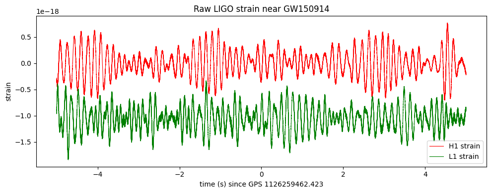
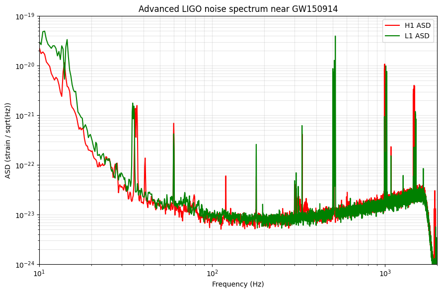
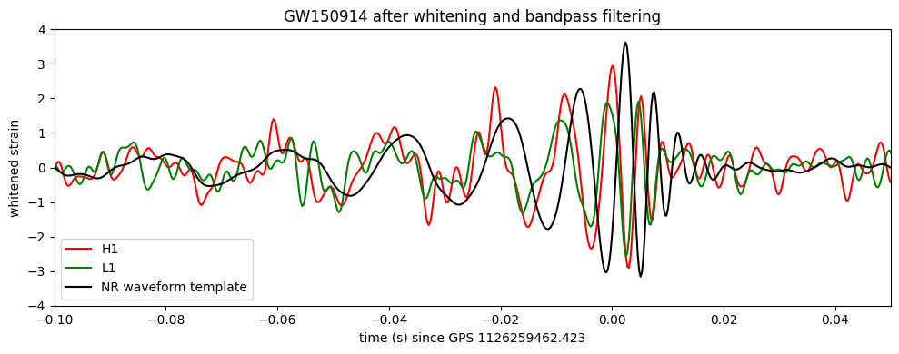
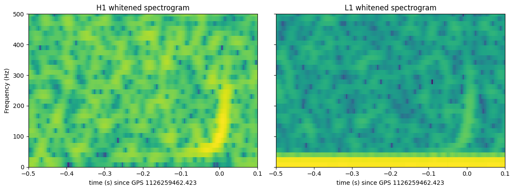
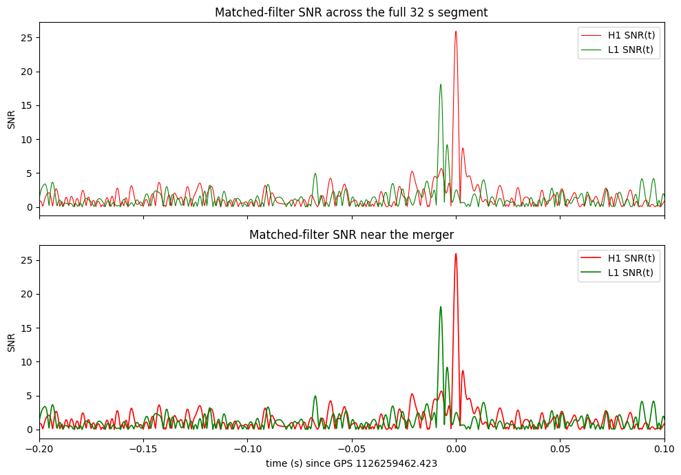

# Project Overview

This project detects the gravitational-wave event GW150914 using publicly available LIGO strain data.
It uses the interferometer strain data from the LIGO Open Science Center for both the Hanford (H1) and Livingston (L1) detectors, together with a numerical-relativity waveform template representing the late inspiral, merger, and ringdown of two merging black holes. The detector data are characterized through their noise power spectra, then processed using whitening and bandpass filtering in order to make the gravitational-wave signal more apparent.
It analyses the processed data through time-domain plots and spectrograms before applying matched filtering in the frequency domain. The matched filter correlates the measured detector strain with the gravitational-wave template while weighting frequencies according to the detector noise, producing a signal-to-noise ratio (SNR) as a function of time.
The resulting H1 and L1 SNR peaks are identified and compared with the published GW150914 measurements. Because the publicly used numerical-relativity template covers only the final portion of the waveform, rather than the much longer template used in the full LIGO search, the project  treats its recovered SNR as a simplified reconstruction rather than a reproduction of the complete production-pipeline result.

Data: \
LIGO Open Science Center (GWOSC), GW150914 strain data: https://gwosc.org/events/GW150914/ \
Event data page: https://gwosc.org/events/GW150914/ \
H1 strain (32s, 4096 Hz, HDF5): https://gwosc.org/GW150914data/H-H1_LOSC_4_V2-1126259446-32.hdf5 \
L1 strain (32s, 4096 Hz, HDF5): https://gwosc.org/GW150914data/L-L1_LOSC_4_V2-1126259446-32.hdf5 \
NR waveform template (text): https://gwosc.org/s/events/GW150914/GW150914_4_NR_waveform.txt \
Detection paper (arXiv): https://arxiv.org/abs/1602.03837 \
Dataset DOI: https://doi.org/10.7935/K5MW2F23 (CC BY 4.0 license) 

---

# Results

---

# Advanced Model Evaluations

### SECTION 2: Strain Data

---

### SECTION 4: Noise Spectrum
---

### SECTION 5: The Whitening and bandpass filtering
---

### SECTION 6: The Spectrogram
---

### SECTION 7: Matched-Filter
---

### SECTION 8: Results

```text
                    detector  our_peak_SNR our_peak_time_GPS  published_SNR published_merger_GPS  time_offset_from_published_s

0                         H1     25.926829      1.126259e+09           20.0         1.126259e+09                      0.000096
1                         L1     18.122539      1.126259e+09           13.0         1.126259e+09                     -0.007229
2         combined (network)     31.632687               NaN           24.0         1.126259e+09                           NaN

```
