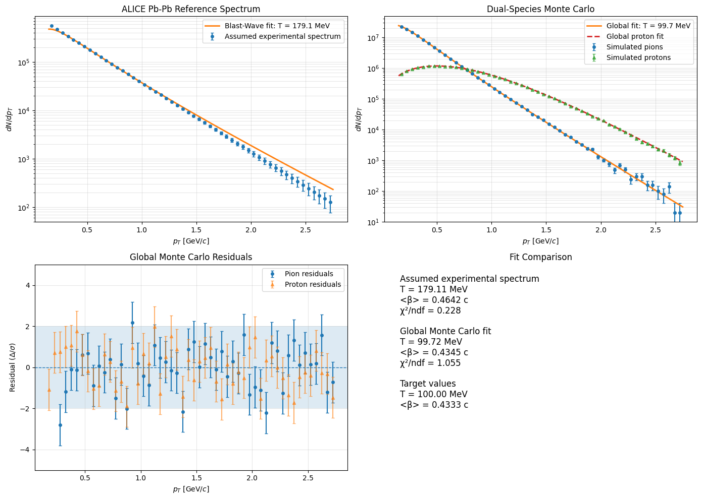

# Project Overview

This project contains a standalone, open-source Python research pipeline designed to model and analyze transverse-momentum spectra from high-energy Pb–Pb collisions. The project is based on open experimental data from the ALICE Collaboration at CERN, specifically the Pb–Pb collision sample at 5.02 TeV from Run 245545 available through the CERN Open Data Portal (https://opendata.cern.ch/record/11446). The pipeline compares an assumed experimental reference spectrum with stochastic Monte Carlo particle production for pions and protons. It uses a numerically stable Blast-Wave model to fit the transverse-momentum distributions and extract kinetic freeze-out temperature and radial flow parameters. The analysis includes numerical Bessel-function stabilization, rejection sampling, statistical uncertainty estimation, a shared two-species fit, residual analysis, and comparison of the fitted Monte Carlo parameters with the assumed experimental reference.
---

# Results

---

# Modeled Spectrum and Residuals

---
