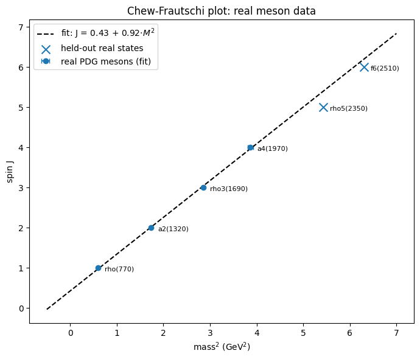
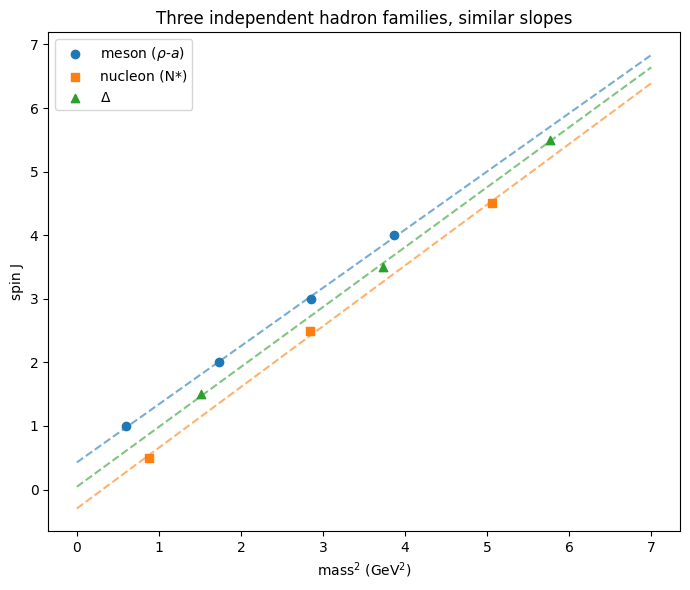
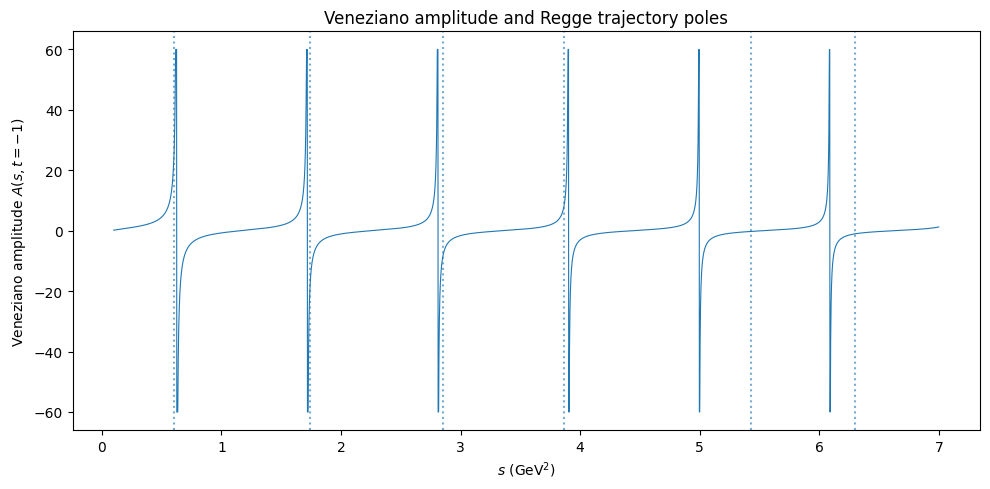

# Project Overview

This project explors the connection between experimentally observed hadron spectra, Regge trajectories, and the Veneziano amplitude.
The analysis begins with measured meson masses and spins from the Particle Data Group. $\rho(770)$, $a_2(1320)$, $\rho_3(1690)$, and $a_4(1970)$, four states, are used to construct a Chew–Frautschi plot of spin $J$ versus mass squared $M^2$. A linear regression is used to determine the Regge trajectory parameters and quantify how closely the measured states follow a straight-line relationship.
Subsequently, the fitted trajectory is tested against two additional measured states that were excluded from the original fit. Their masses are predicted from the fitted relation and compared with their reported values, providing a simple test of whether the trajectory continues beyond the states used to determine it.
The project then extends the analysis to nucleon and $\Delta$ states to compare different hadronic trajectories. The fitted Regge trajectory was then inserted into the Veneziano amplitude through the Euler Beta-function structure. The resulting amplitude is examined as a function of the Mandelstam variable $s$, and its pole positions are compared with the mass spectrum generated by the fitted trajectory.

The project was motivated by the connection of real hadron spectroscopy to one of the historical mathematical structures that motivated the development of string theory, while keeping the computational analysis focused on measured particle data, statistical fitting, trajectory prediction, and the resulting Veneziano amplitude.

# References
Particle Data Group masses used above: R.L. Workman et al. (Particle Data Group), Review of Particle Physics, https://pdg.lbl.gov \
G. Veneziano, "Construction of a crossing-symmetric, Regge behaved amplitude for linearly rising trajectories," Nuovo Cimento A 57, 190 (1968) — the original paper. \
A very readable historical account: G. Veneziano, "The birth of string theory," https://arxiv.org/abs/0902.4189 \

---

# Results

---

# 

### SECTION 2: Chew-Frautchi


---

### SECTION 5: Compare Hadron Trajectories

---

### SECTION 6: Veneziano trajectory

---

### SECTION 6: Predicted Pole Positions

```text
      n   pole_s_GeV2  pole_mass_GeV  matching_state

0     0      -0.46646              0            None
1     1       0.62611        0.79127        rho(770)
2     2        1.7187          1.311        a2(1320)
3     3        2.8112         1.6767      rho3(1690)
4     4        3.9038         1.9758        a4(1970)
5     5        4.9964         2.2353      rho5(2350)
6     6        6.0889         2.4676        f6(2510)

```
