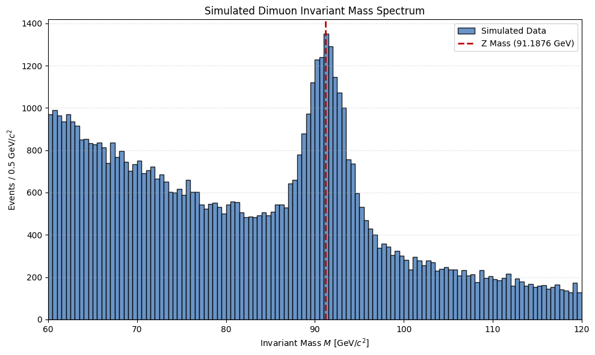
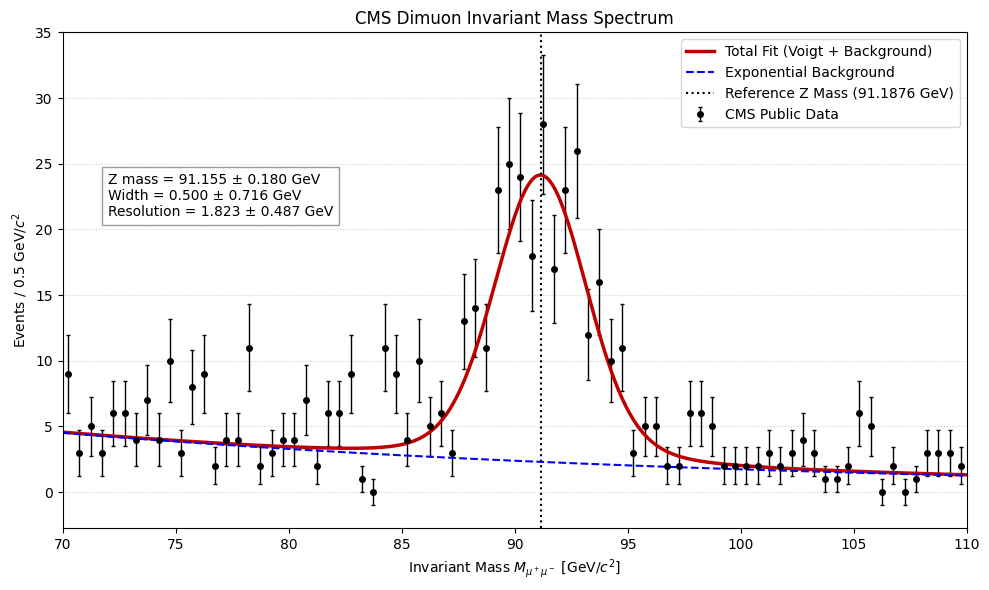

# Project Overview

This project reconstructs and analyzse the Z-boson resonance in dimuon invariant-mass spectra, developing the analysis progressively by beginning with simplified simulated collision events, and advancing to a more realistic resonance model. The final simulation combines an exponential background with a relativistic Breit-Wigner Z-boson line shape and a Gaussian detector-resolution model through numerical convolution, producing a Voigt-like resonance profile.
The analysis is then applied to a public CMS dimuon dataset. The invariant mass is reconstructed from the measured four-momenta of the two particles using the relativistic energy-momentum relation, with opposite-sign dimuon events selected within the Z-boson mass region.
The observed mass spectrum is then fitted with a Voigt signal profile plus an exponential background. The fit extracts the Z-boson mass, intrinsic decay width, and effective detector resolution, allowing the simulated physics model to be compared with the reconstructed experimental spectrum.
The project is based on the works of the CMS collbaoration at CERN for "measurements of the Drell–Yan cross section in pp Collisions at 7 TeV" (https://cmsexperiment.web.cern.ch/news/measurement-drell%E2%80%93yan-cross-section-pp-collisions-7-tev; https://doi.org/10.1007/JHEP10(2011)007).

---

# Results

---

# Dimuon Mass Spectrum

---
---

