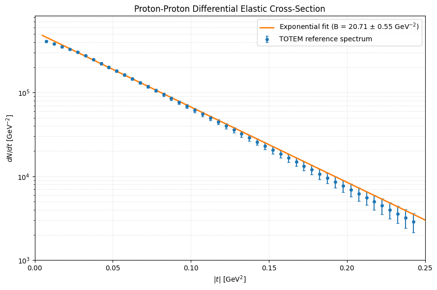

# Project Overview

This project contains a standalone, open-source Python research pipeline designed to analyze proton-proton elastic scattering and characterize the differential cross-section as a function of four-momentum transfer. The project is based on TOTEM experimental data from proton-proton collisions and the published TOTEM analysis by Aspell et al. (2013). The pipeline reconstructs the $|t|$ spectrum, estimates statistical uncertainties, and fits the hadronic scattering region in logarithmic space using exponential models. It compares different fitting windows and model refinements, including linear exponential fits and quadratic extensions, while extracting the proton elastic-scattering slope parameter $B$ and evaluating the goodness of fit through $\chi^2/\mathrm{ndf}$. The analysis also includes an embedded reference spectrum for testing the fitting procedure without requiring a live connection to the original ROOT data.

---

# Results

---

# Modeled Spectrum and Residuals

---
